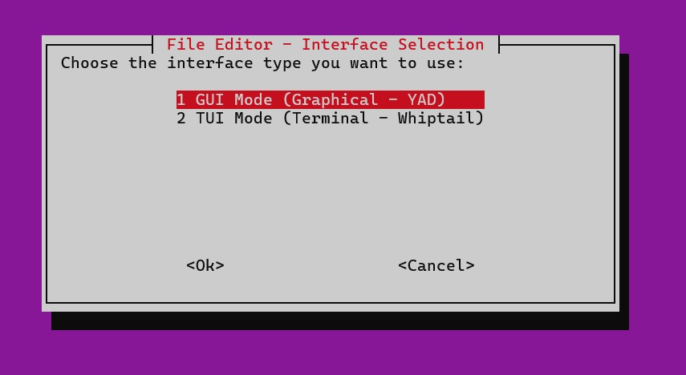
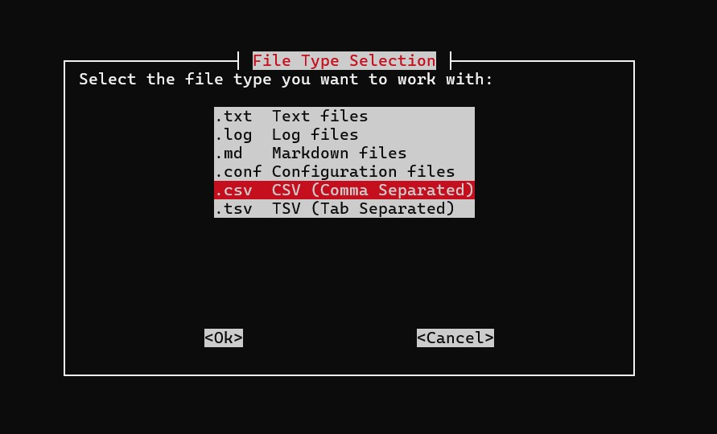
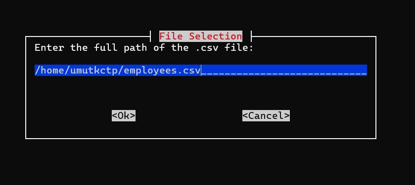
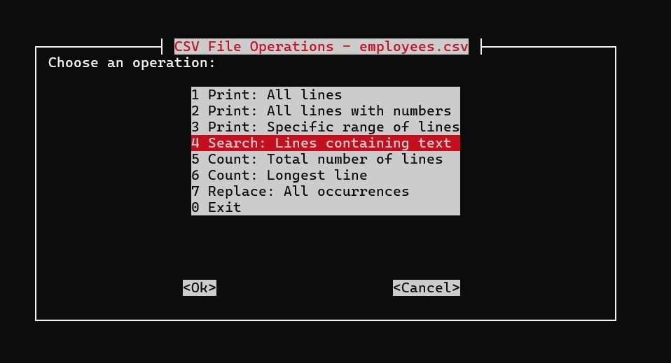
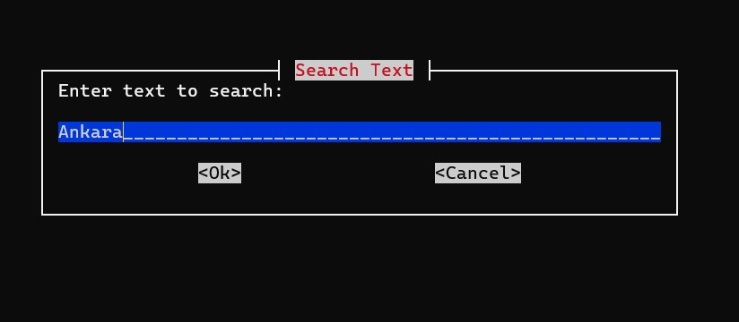
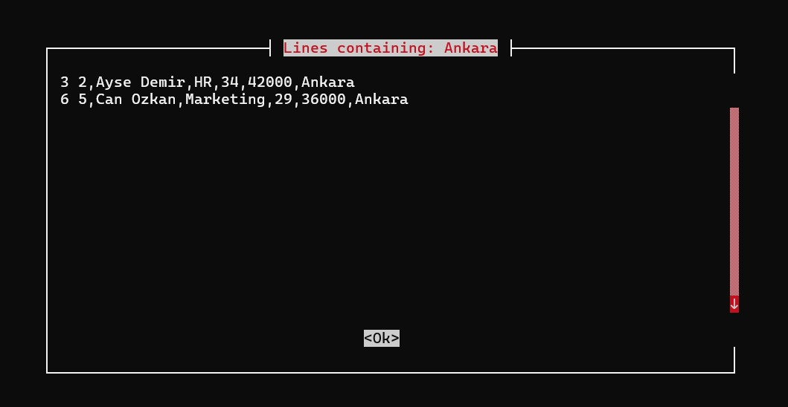

\# Linux File Editor (GUI \& TUI)


Bu proje, Linux sistemlerinde metin ve tablo tabanlı dosyaları düzenlemek için geliştirilmiş, Sed ve Awk komutlarının gücünü kullanıcı dostu arayüzlerle birleştiren bir araçtır. PARDUS işletim sistemiyle tam uyumlu çalışacak şekilde tasarlanmıştır


## Kurulum ve Çalıştırma

- Projenin çalışması için sisteminizde `yad` ve `whiptail` paketlerinin kurulu olması gerekmektedir.


```bash

\# Bağımlılıkları yükleyin

sudo apt-get install yad whiptail


\# Scriptlere çalıştırma izni verin

chmod +x main.sh main\_gui.sh main\_tui.sh


\# Uygulamayı başlatın

./main.sh

```


## Özellikler


Uygulama, seçilen dosya türüne göre dinamik ve gelişmiş işlem seçenekleri sunar:

Çift Arayüz Desteği: Kullanıcılar tercihlerine göre Grafiksel (GUI - YAD) veya Terminal tabanlı (TUI - Whiptail) arayüzü seçebilirler.

Geniş Dosya Uyumluluğu: `.txt`, `.log`, `.md`, `.conf` gibi metin dosyalarının yanı sıra `.csv` ve `.tsv` gibi tablo tabanlı formatları destekler.

Gelişmiş Metin İşleme (Sed/Awk):

Arama ve Filtreleme: Metin içeriğine veya satır uzunluğuna göre (karakter bazlı) gelişmiş arama yapabilir.

Düzenleme: Belirli bir satıra, aralığa veya desen (pattern) eşleşmesine göre metin değiştirme ve silme işlemleri gerçekleştirebilir.

Ekleme: Dosyanın istenen satır öncesine veya sonrasına yeni veri girişi yapabilir.

Veri Analizi ve İstatistik: Toplam satır sayısını hesaplama ve dosyadaki en uzun satırı içeriğiyle birlikte tespit etme özelliklerine sahiptir.

CSV/TSV Yönetimi: Tablo tabanlı dosyalarda belirli sütunları seçme, özel ayırıcılar (separator) kullanma ve sütun bazlı değer eşleştirme yapabilir.

Güvenli Kayıt: Yapılan değişiklikleri orijinal dosyayı bozmadan, yeni bir isimle farklı bir konuma kaydedebilir.


## Proje Yapısı


Proje, kodun okunabilirliğini ve yönetilebilirliğini artırmak amacıyla modüler bir yapıda tasarlanmıştır:


```text

.

├── images/               # Ekran görüntüleri ve görsel materyaller

│   ├── main.png          # Arayüz seçim ekranı görseli

│   ├── gui.png           # YAD arayüzü görseli

│   └── tui.png           # Whiptail arayüzü görseli

├── main.sh               # Ana giriş scripti (Arayüz seçici)

├── main\_gui.sh           # Grafiksel arayüz (GUI) mantığı

├── main\_tui.sh           # Terminal tabanlı arayüz (TUI) mantığı

└── README.md             # Proje dökümantasyonu ve kullanım kılavuzu

```


## Ekran Görüntüleri


Uygulamanın farklı kullanım senaryolarına ait arayüz görüntüleri aşağıda sunulmuştur:


| Output Sample 1                          | Output Sample 2                          |
|------------------------------------------|------------------------------------------|
|           |             |
|------------------------------------------|------------------------------------------| 
| Output Sample 3                          | Output Sample 4                          |
|------------------------------------------|------------------------------------------|
|             |             |
|------------------------------------------|------------------------------------------|
| Output Sample 5                          | Output Sample 6                          |
|------------------------------------------|------------------------------------------|
|             |             |
|------------------------------------------|------------------------------------------|
| Output Sample 7                          | Output Sample 8                          |
|------------------------------------------|------------------------------------------|
|             |             |
|------------------------------------------|------------------------------------------|
| Output Sample 9                          |
|------------------------------------------|
|             |


## Örnek Kullanım Adımları:

1. Giriş: `main.sh` ile arayüz türü seçilir.

2. Dosya Seçimi: İşlem yapılacak dosya yolu ve türü belirlenir.

3. İşlem Menüsü: Dosya türüne (.txt veya .csv) göre dinamik olarak listelenen Sed/Awk operasyonlarından biri seçilir.

4\. \*\*Sonuç:\*\* Yapılan işlem önizlenir ve isteğe bağlı olarak yeni bir dosyaya kaydedilir.

